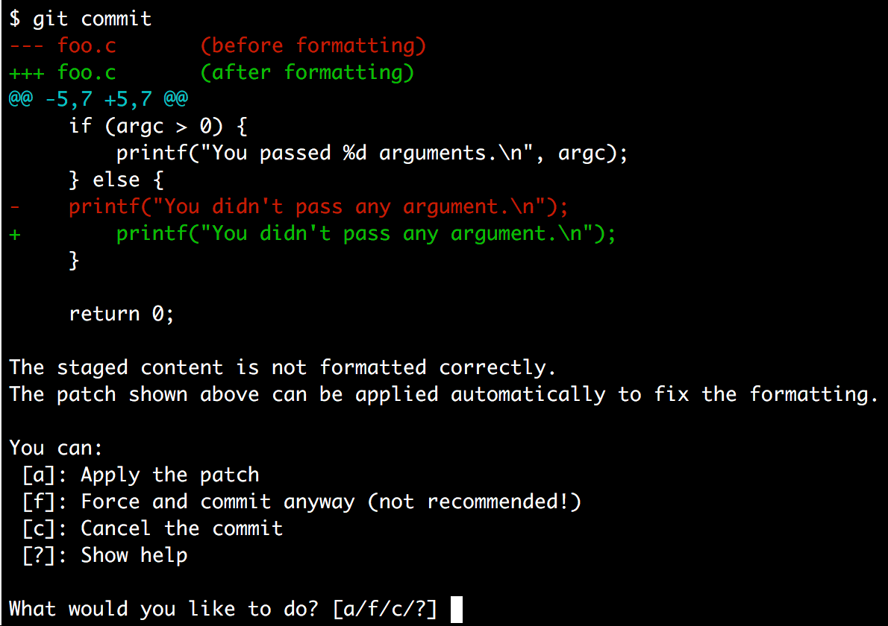

[](https://travis-ci.org/barisione/clang-format-hooks)

`clang-format` git hooks
========================

***Apply a coding style with `clang-format` only to new code added to an existing code base.***

At [Undo](https://www.undo.io/), we decided to use the `clang-format` tool to enforce a consistent coding style for new and refactored code, but without changing the existing one.

This is done through a script (`apply-format`) which can be run manually or through a pre-commit `git` hook which is run every time just before code is committed.

</img>

### What is `clang-format`?

`clang-format` is a tool, part of the LLVM project, which can reformat code to adhere to a configured style.

By default, `clang-format` supports a few pre-defined styles matching the style used by a few important projects, but it's possible to customise specific styles.


Setup
-----

### Dependencies

*  **Ubuntu and Debian:** install the `clang-format` package. You can install a newer version with [these instructions](docs/NewerClangFormatUbuntu.md).
*  **Fedora, CentOS and Red Hat:**  install the `clang` package.
*  **macOS:** install `clang-format` using HomeBrew: `brew install clang-format`.

You can optionally install `colordiff` to get nicer output.

### Configuring `clang-format`

`clang-format` needs to be configured to reformat code according to your project's preferred style.<br>
All the options are described in the official [style options documentation](https://clang.llvm.org/docs/ClangFormatStyleOptions.html), but a great way to start is to use an [interactive configurator](https://zed0.co.uk/clang-format-configurator/).

Once you found the correct style options, just save them in a file called `.clang-format` in the top level directory of your project. From here, the scripts, will load the style automatically.

### Scripts

Add the `apply-format` and `git-pre-commit-format` scripts to your repositories.

You can either copy them (maybe in a `scripts/` sub-directory) or add this whole repository as a `git` submodule.

### Registering the `git` hook

Run at a terminal:

```sh
$ ./git-pre-commit-format install
```

This will add a hook (in `.git/hooks/`) which is run every time you commit.


Using the pre-commit hook
-------------------------

After registering the git hook, you don't need to do anything except for committing your changes.

Every time you commit, the hook will check if your code matches the coding standard. If it doesn't, you get asked what to do and you can decide to:

* Apply the fixes automatically (only to the code you are actually committing, not to unstaged code).
* Commit anyway.
* Abort the commit so you can fix the problem manually.

Note that, if you use `git` through a GUI or some other tool (i.e. not directly on the command line), the script will fail to get your input.
In this case disable the interactive behaviour with:

```sh
$ git config hooks.clangFormatDiffInteractive false
```

For more information on the script use the ``--help`` option.


Manual script
-------------

You can also reformat changed code without committing it using the `apply-format` script directly.

By default, ``apply-format`` reformats only the code which was modified, i.e.  the code that ``git diff`` would show, and prints the diff to the terminal.

If you want to automatically apply the suggested changes, run the script with ``-i``.

If you only want to reformat your staged changes, but not the unstanged ones, use ``--staged``.

For instance, a possible workflow would be similar to:

```sh
$ # Make some changes.
$ vi foo.c
$ # Stage changes you want to commit.
$ git add -p
$ # Reformat the staged changes you made.
$ ./scripts/apply-format -i --staged
$ # Commit the result.
$ git commit
```

It’s also possible to reformat a whole file (using ``--whole-file`` or its
shorter form ``-f``).

For more information on the script use the ``--help`` option.
